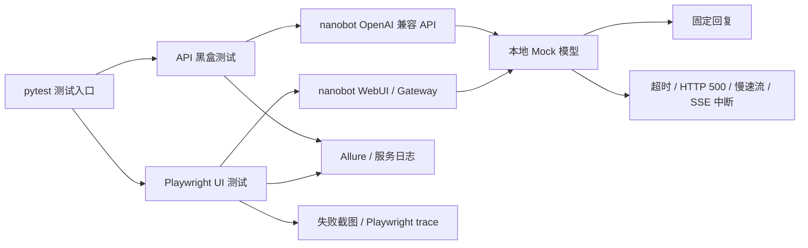

# nanobot-agent-testing

面向开源 AI Agent 框架 [nanobot](https://github.com/HKUDS/nanobot) 的独立黑盒测试项目。

项目从使用者视角启动真实的 nanobot API、Gateway 和 WebUI，验证对话、流式响应、附件、会话与异常恢复等关键链路。测试使用本地可控的 Mock 模型替代真实大模型，在不消耗模型额度的前提下，让正常回复、超时、HTTP 500、慢速流和 SSE 中断都能稳定触发。

当前共收集 **56 条自动化测试**：30 条 API 测试、26 条 UI 测试。最近一次全量结果为 **52 passed，4 xfailed，0 unexpected failures**。

## 为什么测试 Agent 系统

Agent 应用不仅要检查页面能否发送消息，还涉及 HTTP 接口、SSE 流式协议、模型依赖、会话上下文和异步交互。一条对话需要经过多个组件，任一环节异常都可能表现为回答残缺、会话串线、请求无法取消或错误被静默忽略。

本项目重点验证以下风险：

- 核心服务能否启动，API 和 WebUI 是否可访问。
- 普通响应与 SSE 流式响应是否符合公开协议。
- 鉴权、请求参数和附件边界是否得到正确处理。
- 多个并发会话之间是否保持上下文隔离。
- 模型超时、服务异常或流式中断后，系统能否正确反馈并恢复。
- 已确认的产品缺陷是否被持续跟踪，修复后能否及时发现。

nanobot 上游已有单元测试，因此本项目不重复验证内部函数，而是通过公开 HTTP 接口和浏览器观察用户可见结果。

## 测试方案



| 层级 | 主要验证内容 | 设计取舍 |
| --- | --- | --- |
| API | 鉴权、状态码、请求校验、附件协议、SSE、会话并发 | 执行快，适合协议、边界和异常场景 |
| UI | 对话、附件交互、模型切换、会话管理、异常恢复 | 只保留必须通过浏览器确认的关键路径 |
| Mock | 固定回复、上下文回显和故障注入 | 消除真实模型输出的不确定性，避免费用和外部依赖 |
| CI | API/UI 分组执行、报告归档、结果通知 | 验证项目可在空白环境自动安装并完成回归 |

详细的分层原则、风险优先级和自动化准入规则见 [测试策略](docs/TEST_STRATEGY.md)；XMind 用例到 API、UI 和暂缓项的映射见 [用例分层清单](docs/TRACEABILITY.md)。

## 核心设计

### 1. 可控的故障注入

真实网络故障和模型异常难以稳定复现。项目在 Mock 模型中集中定义控制标记，由测试按需触发超时、HTTP 500、慢速输出和 SSE 中断，用同样的输入重复验证异常处理逻辑。

### 2. 独立的测试环境

pytest 会话启动时创建临时配置和临时 workspace，再统一启动 Mock、Gateway 与 OpenAI 兼容 API；执行结束后关闭进程并保存日志。测试不会修改个人的 `~/.nanobot/config.json`，动态数据使用唯一后缀，减少重复执行时的相互污染。

### 3. API 与 UI 分层

鉴权、字段校验、状态码和 SSE 协议放在 API 层；键盘输入、拖拽、弹窗和完整用户路径放在 UI 层。UI 使用按 chat、attachment、session 职责拆分的 Page Object，测试文件只保留业务步骤与断言，不额外创建没有实际复用价值的 `BasePage`。

### 4. 从失败现场到缺陷状态

Allure 记录测试层级、风险标签、运行环境和服务日志；UI 失败时保留整页截图与 Playwright trace。确认属于产品问题后再写入 [BUGS.md](BUGS.md)，并使用严格 `xfail` 跟踪：缺陷仍存在时结果为 `XFAIL`，产品修复后出现 `XPASS` 并使流水线失败，提醒维护者更新缺陷状态和测试预期。

## 代表性场景

| 场景 | 关注点 |
| --- | --- |
| SSE 上游中途断流 | 不完整回答不应被 `[DONE]` 标记为正常完成 |
| 多会话并发请求 | 不同 `session_id` 之间不能泄露历史上下文 |
| 停止慢速响应 | 停止操作应取消后台生成，并允许下一轮对话及时执行 |
| 损坏的 Base64 图片 | 非法附件应返回明确错误，且不能静默进入普通对话 |
| 模型服务超时或异常 | API 应返回可识别的失败结果，页面恢复后仍可继续使用 |

这些场景既检查正常功能，也检查协议边界、状态隔离和失败恢复。当前确认的 4 条缺陷分别涉及附件排序、Base64 校验、SSE 完成语义和后台生成取消，详情见 [BUGS.md](BUGS.md)。

## 当前结果

| 范围 | 结果 |
| --- | ---: |
| 全部测试 | 52 passed，4 xfailed |
| API | 28 passed，2 xfailed |
| UI | 24 passed，2 xfailed |

- 本地源码验证版本：`HKUDS/nanobot` commit [`7cede64`](https://github.com/HKUDS/nanobot/commit/7cede64f078f4435053f4a33964ea719ce582684)
- CI 安装版本：`nanobot-ai[api]==0.3.0`
- 最近一次全量执行日期：2026-10-01
- 持续集成：GitLab CI，分别执行 API 与 UI 测试，生成 Allure 报告并归档失败证据

## 项目结构

```text
mocks/             本地模型服务与故障注入场景
pages/             chat、attachment、session 页面对象
tests/api/         OpenAI 兼容 API 黑盒测试
tests/ui/          Playwright 浏览器端到端测试
tests/conftest.py  临时环境、服务进程和证据收集
utils/             API 请求公共代码
docs/              测试策略与用例分层清单
scripts/           报告生成和 CI 通知脚本
```

## 后续计划：Agent 评测

现阶段自动化主要回答「系统是否按协议和产品预期工作」，不评价 Agent 回答本身的质量。后续计划在现有功能测试之外增加独立评测模块，优先关注：

- 工具调用是否选择正确、参数是否有效。
- 给定任务是否完成，关键步骤是否遗漏。
- 同一任务重复运行时，结果是否稳定。

评测结果具有概率性，不会与当前确定性的功能回归共用同一套通过标准。第一阶段会先固定任务集、评分规则和被测版本，再考虑扩展回答质量、延迟与成本等指标。

## 运行方式

运行项目不是阅读本仓库的前提。以下命令用于本地调试或继续开发。

<details>
<summary>展开安装与执行说明</summary>

### 环境要求

- Python 3.11 或更高版本
- `nanobot-ai[api]==0.3.0` 或对应 nanobot 源码环境
- Playwright Chromium

### 安装依赖

```powershell
python -m venv .venv
.\.venv\Scripts\python.exe -m pip install -r requirements.txt
.\.venv\Scripts\python.exe -m pip install "nanobot-ai[api]==0.3.0"
.\.venv\Scripts\python.exe -m playwright install --no-shell chromium
```

### 执行测试

```powershell
# 全量测试
python -m pytest

# 按测试层级执行
python -m pytest -m api
python -m pytest -m ui

# 按风险或目的执行
python -m pytest -m smoke
python -m pytest -m resilience
python -m pytest -m concurrency
python -m pytest -m security

# 代码检查
python -m ruff check .
```

运行前需确保 `8765`、`8900`、`9999` 和 `18790` 端口未被占用。测试会自动启动并关闭相关服务。

### 查看失败证据

- Allure 原始结果：`reports/allure-results/`
- Allure HTML 报告：`reports/allure-report/index.html`
- pytest HTML 报告：`reports/pytest-report.html`
- 服务日志：`reports/logs/`
- UI 失败截图与 trace：`test-results/`

```powershell
.\scripts\generate-allure-report.ps1
allure open reports/allure-report
python -m playwright show-trace test-results/<trace文件>
```

</details>
